# PlasticPET Selected Plots  

- *Some plots have very poor statistics, but I haven't yet had a chance to regenerate them... 
- If you would like to use those, please tell me, and I will generate them ASAP (will take a day or two, since simulation is fairly slow).
- The upper-right green `code` dropdown offers an option to download as ZIP.

## SETUP

### Geometry

- I am assuming Mr. Proga has supplied this to satisfaction...  

### Cross-Section & Material Definition

- EJ208 & SiPM Response

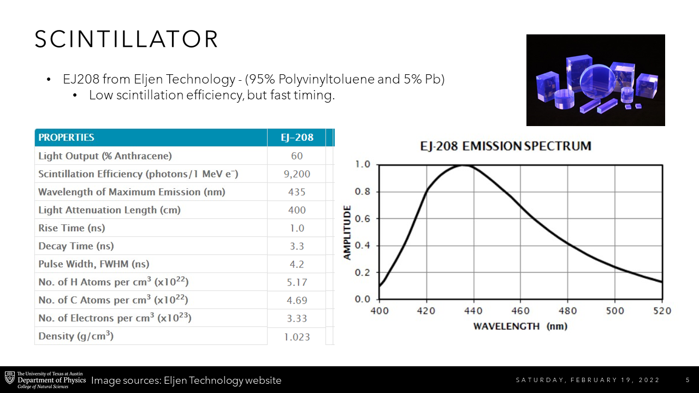 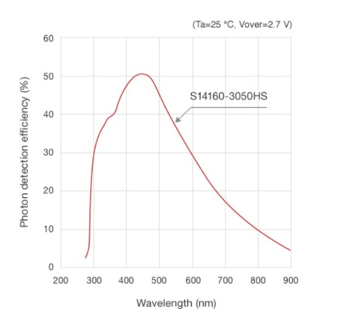

- Geant4 Implementation of Polyvinyltoulene (PVT) against NIST standards:  

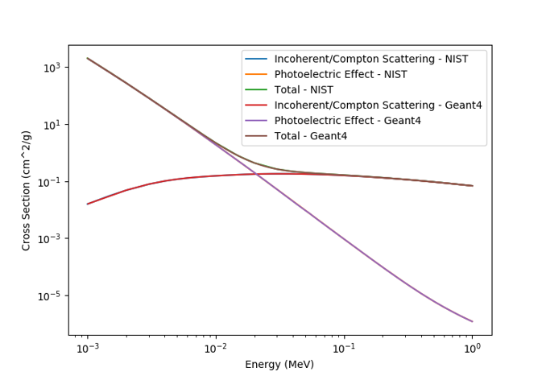 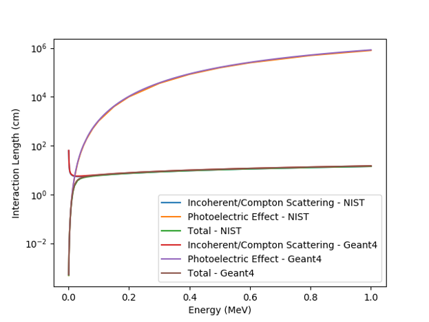  

- Geant4 Implementation of EJ208 (addition of Pb) against NIST standards:  

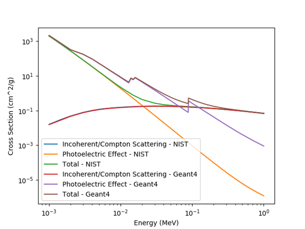   

### Primitives

- Example Creation/Production & Detection Plots; to motivate looking at sum histograms.

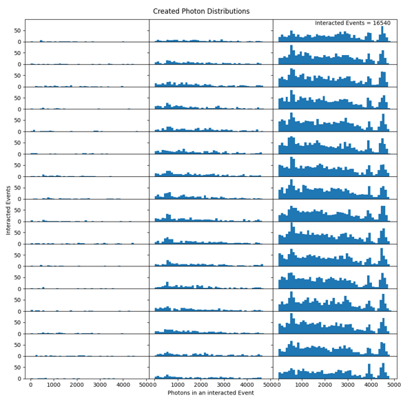 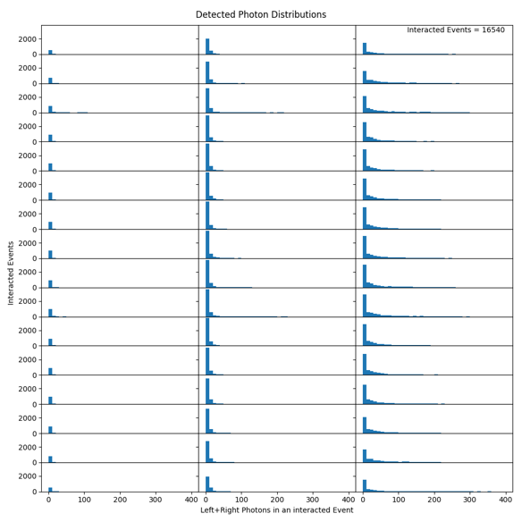  

### Surface Treatment*

#### Light Yield across Varying Plastic Roughness | Motivate using Polished Crystal

- VK_sigmaalpha = 12 degrees, EJ_sigmaalpha = `[2deg, 12deg]` respectively. These values are from a previous G4 paper that used them to discriminate between rough and polished surfaces.

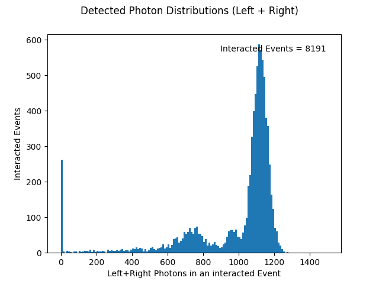 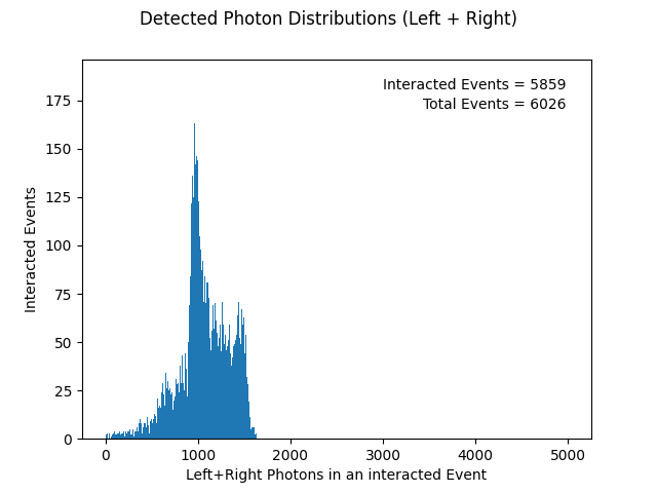 

- VK_sigmaalpha = 0.0001, EJ_sigmaalpha = `[0.0001,1.3deg,4deg,6deg,8deg,12deg,30deg]` respectively. All with 200 events. Note EJ208 is set at 100% reflectivity specially for these tests! VK reflectivity is as measured.  

Images

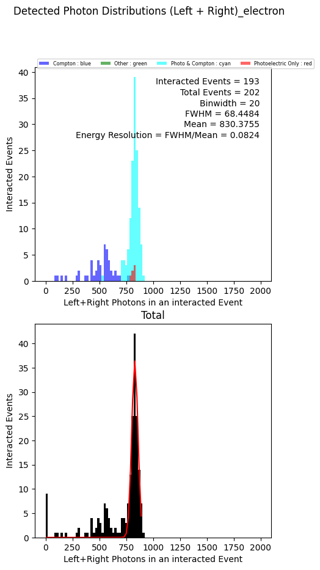 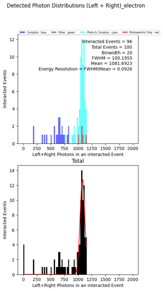 

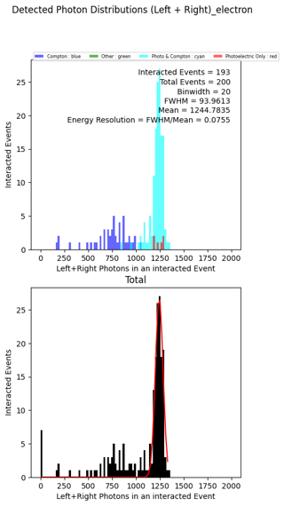 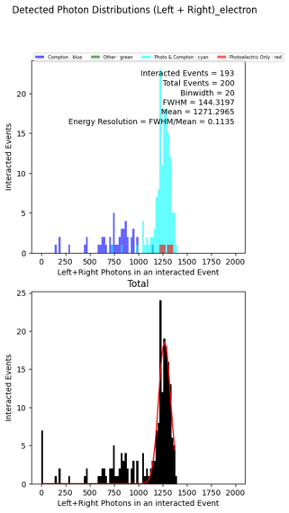 

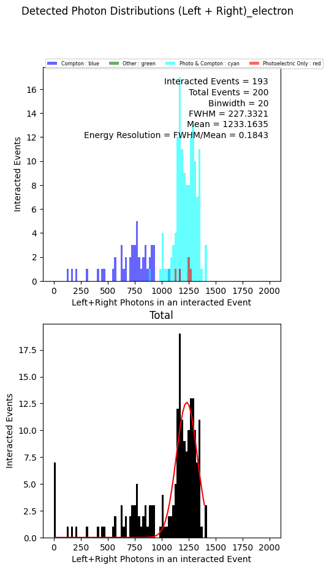 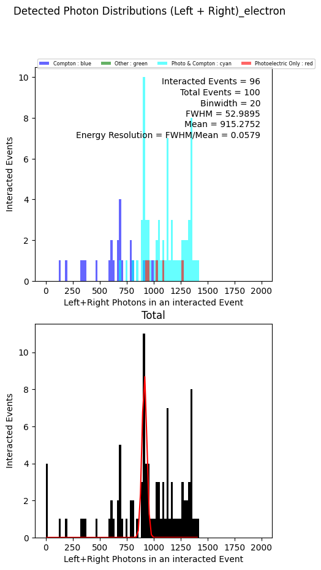  

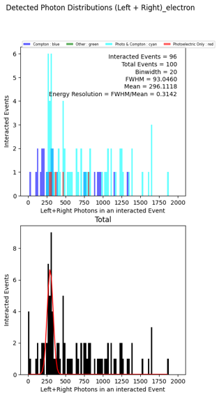  

- EJ & VK_sigmaalpha = `[1.3deg, 12deg]`, respectively.  

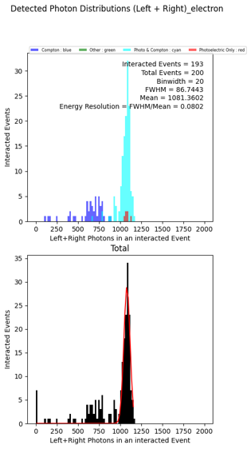 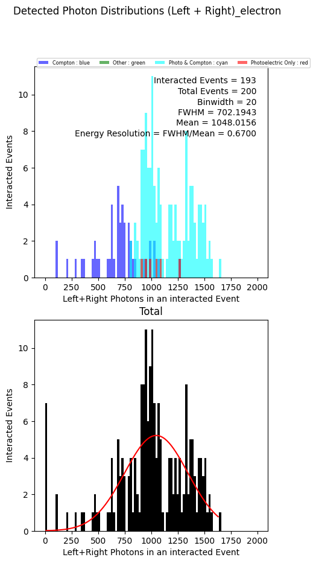  

